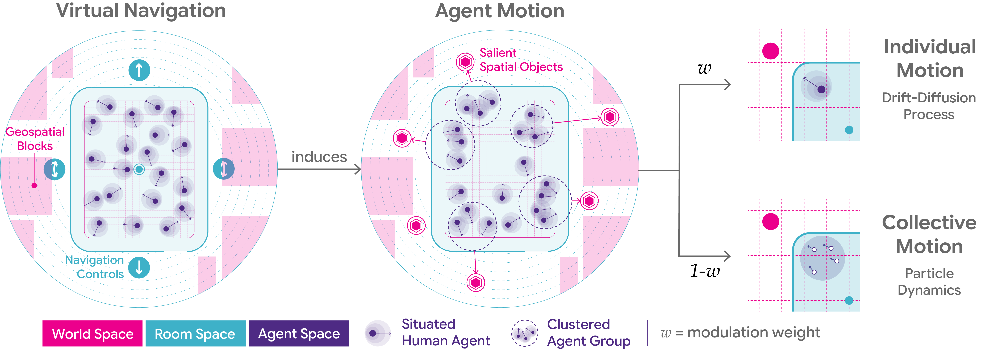

# TogetherFlow
Modeling multi-agent motion dynamics in immersive rooms

This repository contains the simulation and neural estimator results from our paper, [Modeling multi-agent motion dynamics in immersive rooms]().  