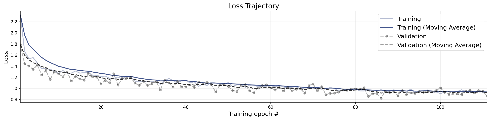
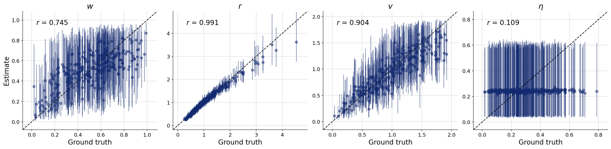
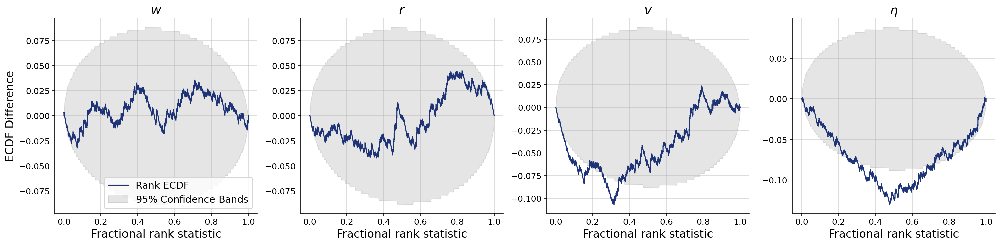
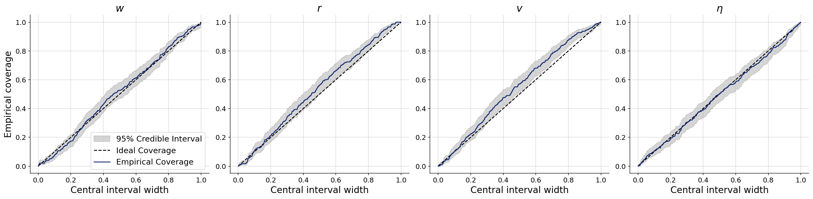
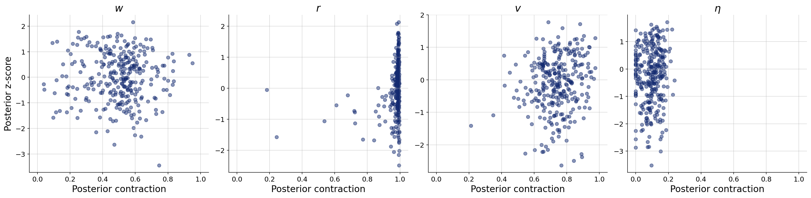

# Baseline complete-pooling model, online training

**Variant:** `v0-baseline-online`  
**Addresses:** Reference arm — corrects the overfitting in the offline night

## Why this arm exists

The offline arms all overfit badly: validation loss bottomed around epoch 11 and then degraded by ~60% while training loss kept falling, leaving every parameter narrow but miscalibrated. Online training draws fresh simulations for every batch, so the effective budget is ~480,000 simulations rather than 5,000 and overfitting is impossible by construction. This arm establishes whether the offline findings survive once the model is properly trained.

## Generative Configuration

| Setting | Value |
|---------|-------|
| Reviewer point addressed | Reference arm — corrects the overfitting in the offline night |
| Prior | complete_pooling_prior |
| Inferred parameters | w, r, v, noise |
| Observable channels | positions, rotations, neighbors, distances, angular_velocities, neighbor_fluctuations |
| Reference radii (r-free counts) | — |
| Beacon strengths | uniform |
| Beacon spread | 50 |
| Agents / beacons | 49 / 4 |
| Time horizon / dt | 60s / 0.1 |
| Seed | 20260803 |

## Training and Network Configuration

| Setting | Value |
|---------|-------|
| Inference network | FlowMatching (Base, widths 256x4, time_embedding_dim 32) |
| Summary network | SummaryNet — BiLSTM (summary_dim=12) |
| Epochs | 300 |
| Batch size | 32 |
| Validation data | 300 simulations |
| Test data | 300 simulations |
| Training mode | online |
| Early stopping | patience 25, best weights restored |
| Simulation budget | 300 x 50 x 32 (online, fresh each batch) |
| Wall-clock | 8.9 min |

## Convergence

The training loss curve shows the optimization objective over epochs. A healthy curve decreases smoothly and plateaus. Key warning signs: (i) a growing gap between training and validation loss indicates overfitting; (ii) loss still visibly decreasing at the final epoch means the network could benefit from more epochs; (iii) NaN spikes indicate numerical instability, often caused by extreme simulator outputs or missing standardization.

**Assessment:** Training converged without detected issues: the loss decreased and plateaued, and no divergence between training and validation loss was flagged.

## Parameter Recovery

Each panel plots the posterior median (point estimate) against the true parameter value across held-out simulations. Points falling on the diagonal indicate perfect recovery. Vertical bars represent 95% posterior credible intervals — their width reflects estimation uncertainty. Systematic deviations from the diagonal reveal bias; wide intervals indicate the data are only weakly informative for that parameter.

**Assessment:** w, r, v, noise fall short.

## Calibration and Coverage

**Calibration ECDF** — Simulation-based calibration (SBC) plots show the empirical CDF of posterior ranks. Well-calibrated posteriors produce ECDFs close to the uniform diagonal. Lines consistently above the diagonal indicate overconfident (too narrow) posteriors; lines below indicate underconfident (too wide) posteriors.

**Coverage** — Shows the fraction of held-out true values falling within nominal credible intervals (e.g., 50%, 80%, 95%). Well-calibrated models yield empirical coverage matching the nominal level. Under-coverage means the credible intervals are too narrow; over-coverage means they are too wide.

**Assessment:** w, r, v, noise show calibration in the acceptable range.

## Posterior Z-Score and Contraction

The z-score–contraction plot summarizes posterior quality in two dimensions. The x-axis shows **posterior contraction** — the fraction by which the posterior variance has shrunk relative to the prior variance. Values near 0 indicate no information gain (the data are uninformative for that parameter); values near 1 indicate near-complete information gain. The y-axis shows the **posterior z-score** — the average standardized deviation between the posterior mean and the true value. Symmetric values around 0 indicate an unbiased (Gaussian-like) posterior. The ideal region is the middle-right corner (z-scores distributed around 0, high contraction).

**Assessment:** r show contraction in the acceptable range; w, v, noise fall short.

## Numerical Diagnostic Summary

| Metric | w | r | v | noise |
|--------|-----|-----|-----|-----|
| NRMSE | 0.682 | 0.120 | 0.472 | 0.943 |
| Log-gamma | 1.193 | 0.097 | -5.714 | -5.708 |
| ECE | 0.016 | 0.038 | 0.046 | 0.009 |
| Post. Contraction | 0.518 | 0.988 | 0.739 | 0.094 |

**w** — excellent calibration; poor recovery; low contraction

**r** — excellent calibration; fair recovery; high contraction

**v** — excellent calibration; poor recovery; low contraction

**noise** — excellent calibration; poor recovery; low contraction

## Suggested Next Steps

1. Poor recovery for w, v, noise — increase network capacity and training duration; if no improvement, these parameters may be weakly identifiable.
2. Low contraction for w, v, noise — the data may not be informative for these parameters; consider a more informative prior or a richer summary network.
