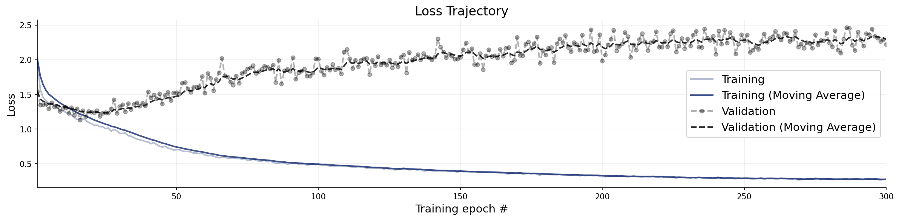
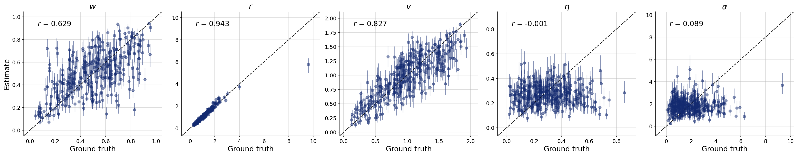
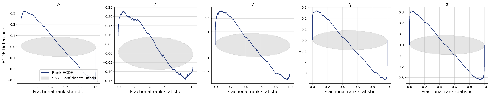
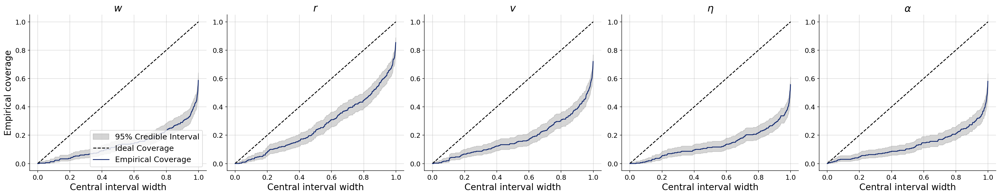
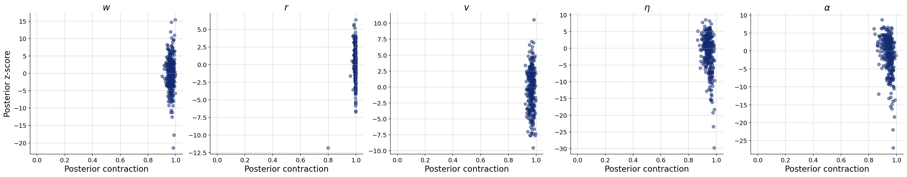

# Beacon salience inferred (beacons outside the room, as published)

**Variant:** `v2-salience-spread50`  
**Addresses:** Reviewer point 8

## Why this arm exists

The Unity twin lets an agent re-target between beacons; the Python training simulator selected the nearest beacon unconditionally. The unified score s_b^alpha / d_ib closes that gap, and promoting alpha from a fixed setting to an inferred parameter turns the discrepancy into a measurable quantity: if alpha is recoverable, the training simulator can represent the twin's switching behaviour rather than merely approximating it. This arm keeps the existing beacon placement (spread 50 over an 8x10 room) so it stays comparable with the published figures.

## Generative Configuration

| Setting | Value |
|---------|-------|
| Reviewer point addressed | Reviewer point 8 |
| Prior | salience_prior |
| Inferred parameters | w, r, v, noise, alpha |
| Observable channels | positions, rotations, neighbors, distances, angular_velocities, neighbor_fluctuations |
| Reference radii (r-free counts) | — |
| Beacon strengths | [1.0, 1.0, 1.0, 8.0] |
| Beacon spread | 50 |
| Agents / beacons | 49 / 4 |
| Time horizon / dt | 60s / 0.1 |
| Seed | 20260803 |

## Training and Network Configuration

| Setting | Value |
|---------|-------|
| Inference network | FlowMatching (Base, widths 256x4, time_embedding_dim 32) |
| Summary network | SummaryNet — BiLSTM (summary_dim=15) |
| Epochs | 300 |
| Batch size | 32 |
| Validation data | 300 simulations |
| Test data | 300 simulations |
| Training mode | offline |
| Simulation budget | 5000 training simulations |
| Wall-clock | 10.9 min |

## Convergence

The training loss curve shows the optimization objective over epochs. A healthy curve decreases smoothly and plateaus. Key warning signs: (i) a growing gap between training and validation loss indicates overfitting; (ii) loss still visibly decreasing at the final epoch means the network could benefit from more epochs; (iii) NaN spikes indicate numerical instability, often caused by extreme simulator outputs or missing standardization.

**Assessment:** Training completed with the following flags: Overfitting detected (avg val/train ratio 8.209x over last 10% of epochs) — reduce capacity, add regularization, or increase simulation budget. Treat the downstream diagnostics as provisional until these are addressed.

## Parameter Recovery

Each panel plots the posterior median (point estimate) against the true parameter value across held-out simulations. Points falling on the diagonal indicate perfect recovery. Vertical bars represent 95% posterior credible intervals — their width reflects estimation uncertainty. Systematic deviations from the diagonal reveal bias; wide intervals indicate the data are only weakly informative for that parameter.

**Assessment:** r show recovery in the acceptable range; w, v, noise, alpha fall short.

## Calibration and Coverage

**Calibration ECDF** — Simulation-based calibration (SBC) plots show the empirical CDF of posterior ranks. Well-calibrated posteriors produce ECDFs close to the uniform diagonal. Lines consistently above the diagonal indicate overconfident (too narrow) posteriors; lines below indicate underconfident (too wide) posteriors.

**Coverage** — Shows the fraction of held-out true values falling within nominal credible intervals (e.g., 50%, 80%, 95%). Well-calibrated models yield empirical coverage matching the nominal level. Under-coverage means the credible intervals are too narrow; over-coverage means they are too wide.

**Assessment:** w, r, v, noise, alpha fall short.

## Posterior Z-Score and Contraction

The z-score–contraction plot summarizes posterior quality in two dimensions. The x-axis shows **posterior contraction** — the fraction by which the posterior variance has shrunk relative to the prior variance. Values near 0 indicate no information gain (the data are uninformative for that parameter); values near 1 indicate near-complete information gain. The y-axis shows the **posterior z-score** — the average standardized deviation between the posterior mean and the true value. Symmetric values around 0 indicate an unbiased (Gaussian-like) posterior. The ideal region is the middle-right corner (z-scores distributed around 0, high contraction).

**Assessment:** noise, alpha show contraction in the acceptable range; w, r, v fall short.

## Numerical Diagnostic Summary

| Metric | w | r | v | noise | alpha |
|--------|-----|-----|-----|-----|-----|
| NRMSE | 0.438 | 0.098 | 0.342 | 0.660 | 0.605 |
| Log-gamma | -inf | -inf | -inf | -inf | -inf |
| ECE | 0.377 | 0.270 | 0.351 | 0.392 | 0.395 |
| Post. Contraction | 0.964 | 0.997 | 0.967 | 0.944 | 0.947 |

**w** — poor calibration; poor recovery; poor — overconfident

**r** — poor calibration; good recovery; poor — overconfident

**v** — poor calibration; poor recovery; poor — overconfident

**noise** — poor calibration; poor recovery; medium contraction

**alpha** — poor calibration; poor recovery; medium contraction

## Suggested Next Steps

1. Overfitting detected (val/train loss ratio 8.209x in final 10% of epochs) — reduce network capacity, add regularization, or increase simulation budget.
2. Poor calibration for w, r, v, noise, alpha — increase summary network capacity or train for more epochs.
3. Poor recovery for w, v, noise, alpha — increase network capacity and training duration; if no improvement, these parameters may be weakly identifiable.
4. Overconfident posteriors for w, r, v — inspect the simulator for potential issues and consider increasing the simulation budget.
