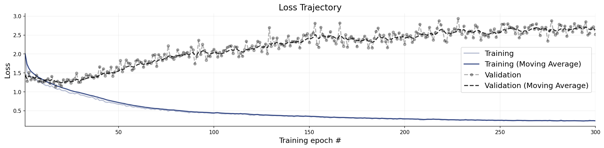
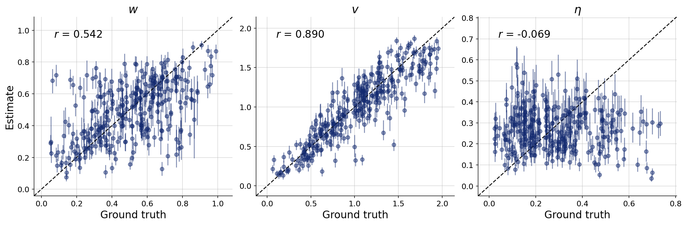
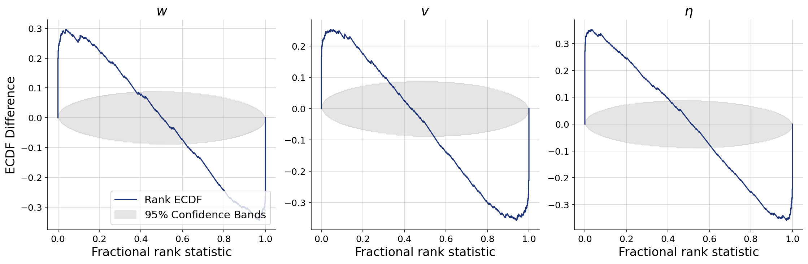
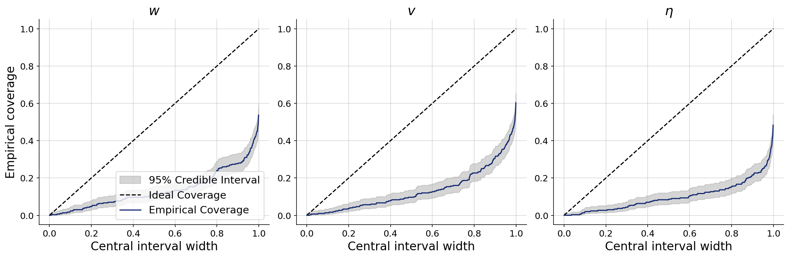
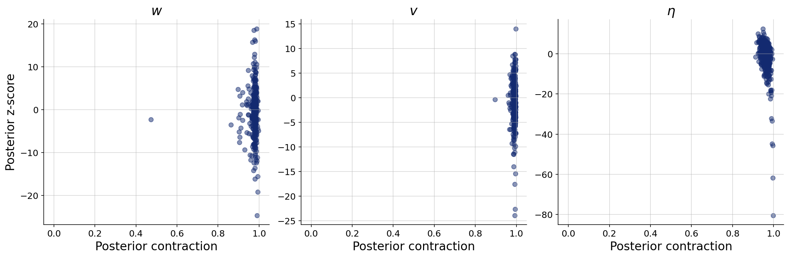

# Sensing radius held as a known constant

**Variant:** `v3a-fixed-radius`  
**Addresses:** Reviewer point 2 (option: fix r)

## Why this arm exists

Takes the reviewer's first option literally: r is pinned to a known constant and dropped from the inference targets. The question this arm answers is what the other three parameters cost in recovery and calibration when r is no longer competing with them.

## Generative Configuration

| Setting | Value |
|---------|-------|
| Reviewer point addressed | Reviewer point 2 (option: fix r) |
| Prior | fixed_radius_prior |
| Inferred parameters | w, v, noise |
| Observable channels | positions, rotations, neighbors, distances, angular_velocities, neighbor_fluctuations |
| Reference radii (r-free counts) | — |
| Beacon strengths | uniform |
| Beacon spread | 50 |
| Agents / beacons | 49 / 4 |
| Time horizon / dt | 60s / 0.1 |
| Seed | 20260803 |

## Training and Network Configuration

| Setting | Value |
|---------|-------|
| Inference network | FlowMatching (Base, widths 256x4, time_embedding_dim 32) |
| Summary network | SummaryNet — BiLSTM (summary_dim=9) |
| Epochs | 300 |
| Batch size | 32 |
| Validation data | 300 simulations |
| Test data | 300 simulations |
| Training mode | offline |
| Simulation budget | 5000 training simulations |
| Wall-clock | 11.0 min |

## Convergence

The training loss curve shows the optimization objective over epochs. A healthy curve decreases smoothly and plateaus. Key warning signs: (i) a growing gap between training and validation loss indicates overfitting; (ii) loss still visibly decreasing at the final epoch means the network could benefit from more epochs; (iii) NaN spikes indicate numerical instability, often caused by extreme simulator outputs or missing standardization.

**Assessment:** Training completed with the following flags: Overfitting detected (avg val/train ratio 11.216x over last 10% of epochs) — reduce capacity, add regularization, or increase simulation budget; Loss still decreasing at final epoch — consider more epochs. Treat the downstream diagnostics as provisional until these are addressed.

## Parameter Recovery

Each panel plots the posterior median (point estimate) against the true parameter value across held-out simulations. Points falling on the diagonal indicate perfect recovery. Vertical bars represent 95% posterior credible intervals — their width reflects estimation uncertainty. Systematic deviations from the diagonal reveal bias; wide intervals indicate the data are only weakly informative for that parameter.

**Assessment:** w, v, noise fall short.

## Calibration and Coverage

**Calibration ECDF** — Simulation-based calibration (SBC) plots show the empirical CDF of posterior ranks. Well-calibrated posteriors produce ECDFs close to the uniform diagonal. Lines consistently above the diagonal indicate overconfident (too narrow) posteriors; lines below indicate underconfident (too wide) posteriors.

**Coverage** — Shows the fraction of held-out true values falling within nominal credible intervals (e.g., 50%, 80%, 95%). Well-calibrated models yield empirical coverage matching the nominal level. Under-coverage means the credible intervals are too narrow; over-coverage means they are too wide.

**Assessment:** w, v, noise fall short.

## Posterior Z-Score and Contraction

The z-score–contraction plot summarizes posterior quality in two dimensions. The x-axis shows **posterior contraction** — the fraction by which the posterior variance has shrunk relative to the prior variance. Values near 0 indicate no information gain (the data are uninformative for that parameter); values near 1 indicate near-complete information gain. The y-axis shows the **posterior z-score** — the average standardized deviation between the posterior mean and the true value. Symmetric values around 0 indicate an unbiased (Gaussian-like) posterior. The ideal region is the middle-right corner (z-scores distributed around 0, high contraction).

**Assessment:** w, v, noise fall short.

## Numerical Diagnostic Summary

| Metric | w | v | noise |
|--------|-----|-----|-----|
| NRMSE | 0.398 | 0.225 | 0.636 |
| Log-gamma | -inf | -inf | -inf |
| ECE | 0.393 | 0.400 | 0.413 |
| Post. Contraction | 0.979 | 0.990 | 0.960 |

**w** — poor calibration; poor recovery; poor — overconfident

**v** — poor calibration; poor recovery; poor — overconfident

**noise** — poor calibration; poor recovery; poor — overconfident

## Suggested Next Steps

1. Overfitting detected (val/train loss ratio 11.216x in final 10% of epochs) — reduce network capacity, add regularization, or increase simulation budget.
2. Loss is still decreasing at the final epoch — increase the number of training epochs (e.g., double the current value).
3. Poor calibration for w, v, noise — increase summary network capacity or train for more epochs.
4. Poor recovery for w, v, noise — increase network capacity and training duration; if no improvement, these parameters may be weakly identifiable.
5. Overconfident posteriors for w, v, noise — inspect the simulator for potential issues and consider increasing the simulation budget.
