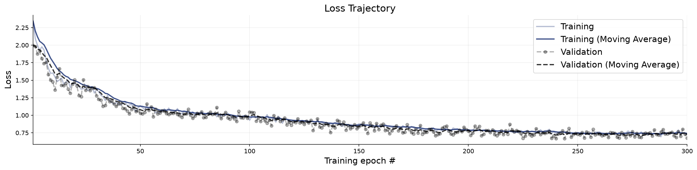
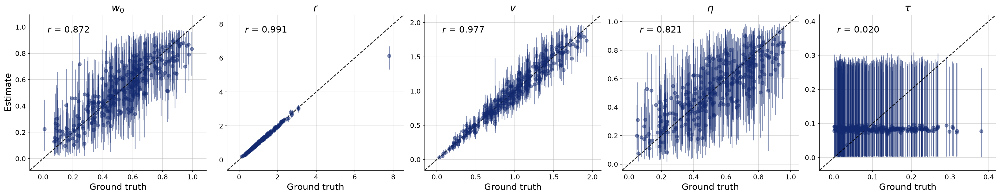
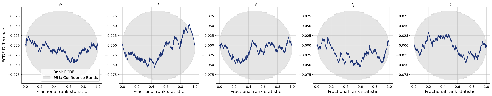
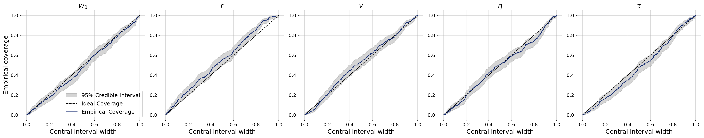
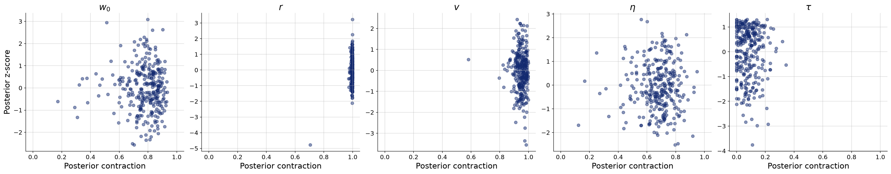

# Non-stationary influence weight (logit random walk)

**Variant:** `v5-timevarying-w`  
**Addresses:** Reviewer point 6

## Why this arm exists

The published model fixes w for the duration of a trial, asserting that an agent's balance between beacon-driven and neighbour-driven motion never shifts. This arm replaces the parameter with a parameter path, logit w_t = logit w_{t-1} + tau sqrt(dt) xi_t, and infers (w0, tau) instead of a single w. The point is that tau = 0 recovers the stationary model exactly, so stationarity stops being an assumption and becomes a restriction the data can reject — or fail to reject, which is equally reportable. Read the contraction on tau first: if the data cannot distinguish a walk from a constant, that is the honest answer to the reviewer, and it is a statement about identifiability rather than about human behaviour.

## Generative Configuration

| Setting | Value |
|---------|-------|
| Reviewer point addressed | Reviewer point 6 |
| Prior | prior_nonstationary |
| Inferred parameters | w0, r, v, noise, tau |
| Observable channels | positions, rotations, neighbors, distances, angular_velocities, neighbor_fluctuations |
| Reference radii (r-free counts) | — |
| Beacon strengths | uniform |
| Beacon spread | 50 |
| Heading update | relative bearing (rotationally invariant) |
| Agents / beacons | 49 / 4 |
| Time horizon / dt | 60s / 0.1 |
| Seed | 20260803 |

## Training and Network Configuration

| Setting | Value |
|---------|-------|
| Inference network | FlowMatching (Base, widths 256x4, time_embedding_dim 32) |
| Summary network | TransformerSummaryNet — TimeSeriesTransformer, Base (summary_dim=15) |
| Epochs | 300 |
| Batch size | 32 |
| Validation data | 300 simulations |
| Test data | 300 simulations |
| Training mode | online |
| Early stopping | off |
| Simulation budget | 300 x 50 x 32 (online, fresh each batch) |
| Wall-clock | 33.5 min |

## Convergence

The training loss curve shows the optimization objective over epochs. A healthy curve decreases smoothly and plateaus. Key warning signs: (i) a growing gap between training and validation loss indicates overfitting; (ii) loss still visibly decreasing at the final epoch means the network could benefit from more epochs; (iii) NaN spikes indicate numerical instability, often caused by extreme simulator outputs or missing standardization.

**Assessment:** Training completed with the following flags: Loss still decreasing at final epoch — consider more epochs. Treat the downstream diagnostics as provisional until these are addressed.

## Parameter Recovery

Each panel plots the posterior median (point estimate) against the true parameter value across held-out simulations. Points falling on the diagonal indicate perfect recovery. Vertical bars represent 95% posterior credible intervals — their width reflects estimation uncertainty. Systematic deviations from the diagonal reveal bias; wide intervals indicate the data are only weakly informative for that parameter.

**Assessment:** r show recovery in the acceptable range; w0, v, noise, tau fall short.

## Calibration and Coverage

**Calibration ECDF** — Simulation-based calibration (SBC) plots show the empirical CDF of posterior ranks. Well-calibrated posteriors produce ECDFs close to the uniform diagonal. Lines consistently above the diagonal indicate overconfident (too narrow) posteriors; lines below indicate underconfident (too wide) posteriors.

**Coverage** — Shows the fraction of held-out true values falling within nominal credible intervals (e.g., 50%, 80%, 95%). Well-calibrated models yield empirical coverage matching the nominal level. Under-coverage means the credible intervals are too narrow; over-coverage means they are too wide.

**Assessment:** w0, r, v, noise, tau show calibration in the acceptable range.

## Posterior Z-Score and Contraction

The z-score–contraction plot summarizes posterior quality in two dimensions. The x-axis shows **posterior contraction** — the fraction by which the posterior variance has shrunk relative to the prior variance. Values near 0 indicate no information gain (the data are uninformative for that parameter); values near 1 indicate near-complete information gain. The y-axis shows the **posterior z-score** — the average standardized deviation between the posterior mean and the true value. Symmetric values around 0 indicate an unbiased (Gaussian-like) posterior. The ideal region is the middle-right corner (z-scores distributed around 0, high contraction).

**Assessment:** r, v show contraction in the acceptable range; w0, noise, tau fall short.

## Numerical Diagnostic Summary

| Metric | w0 | r | v | noise | tau |
|--------|-----|-----|-----|-----|-----|
| NRMSE | 0.473 | 0.054 | 0.221 | 0.556 | 0.978 |
| Log-gamma | 2.800 | -3.002 | 2.407 | 1.822 | 3.948 |
| ECE | 0.017 | 0.048 | 0.019 | 0.014 | 0.032 |
| Post. Contraction | 0.799 | 0.997 | 0.953 | 0.692 | 0.076 |

**w0** — excellent calibration; poor recovery; low contraction

**r** — excellent calibration; good recovery; high contraction

**v** — excellent calibration; poor recovery; high contraction

**noise** — excellent calibration; poor recovery; low contraction

**tau** — excellent calibration; poor recovery; low contraction

## Suggested Next Steps

1. Loss is still decreasing at the final epoch — increase the number of training epochs (e.g., double the current value).
2. Poor recovery for w0, v, noise, tau — increase network capacity and training duration; if no improvement, these parameters may be weakly identifiable.
3. Low contraction for w0, noise, tau — the data may not be informative for these parameters; consider a more informative prior or a richer summary network.
