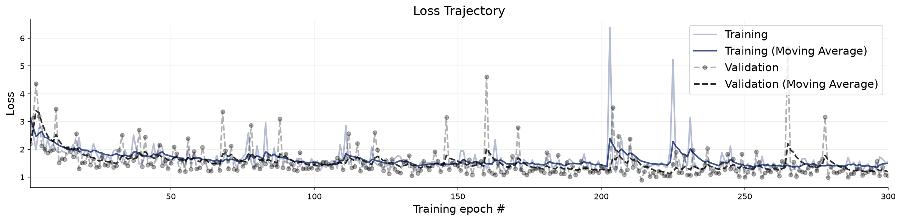
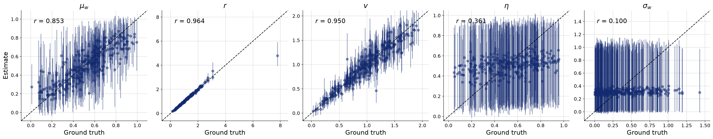
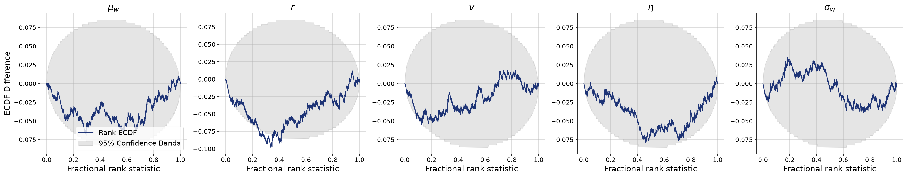
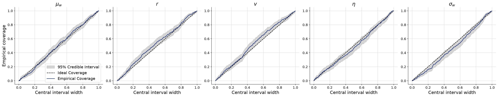
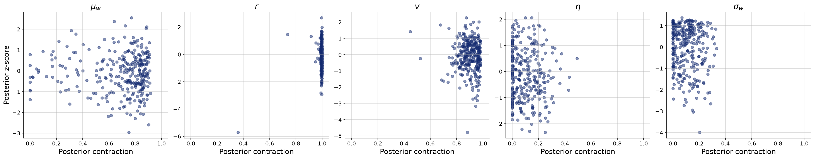

# Per-agent influence weight, population-level inference

**Variant:** `v6a-partial-pooling`  
**Addresses:** Reviewer point 4 / R2 weakness 2

## Why this arm exists

Every published configuration gives all 49 agents one parameter vector, which the reviewers single out as the model's least defensible assumption about people. Here each agent draws its own weight from a population distribution, w_i = sigmoid(logit(mu_w) + sigma_w z_i), and the inference targets are the population parameters. sigma_w is the quantity that carries the argument: if it is recoverable the model detects heterogeneity, and sigma_w = 0 is exactly complete pooling, so the published specification becomes a restriction the data can test rather than an assumption it inherits.

Two configuration choices are forced by what comes next rather than by this arm. The inference network is a DiffusionModel and the adapter does not constrain, because CompositionalWorkflow accepts only the former and refuses a non-zero log-det Jacobian; a checkpoint trained any other way cannot be composed across trials afterwards. Read this arm against v0-diffusion rather than v0-reference, since the estimator differs from the flow-matching arms.

## Generative Configuration

| Setting | Value |
|---------|-------|
| Reviewer point addressed | Reviewer point 4 / R2 weakness 2 |
| Prior | partial_pooling_prior |
| Inferred parameters | mu_w, r, v, noise, sigma_w |
| Observable channels | positions, rotations, neighbors, distances, angular_velocities, neighbor_fluctuations |
| Reference radii (r-free counts) | — |
| Beacon strengths | uniform |
| Beacon spread | 50 |
| Heading update | relative bearing (rotationally invariant) |
| Agents / beacons | 49 / 4 |
| Time horizon / dt | 20s / 0.1 |
| Seed | 20260803 |

## Training and Network Configuration

| Setting | Value |
|---------|-------|
| Inference network | FlowMatching (Base, widths 256x4, time_embedding_dim 32) |
| Summary network | SummaryNet — Conv1D + BiLSTM (summary_dim=15) |
| Epochs | 300 |
| Batch size | 32 |
| Validation data | 300 simulations |
| Test data | 300 simulations |
| Training mode | online |
| Early stopping | off |
| Simulation budget | 300 x 50 x 32 (online, fresh each batch) |
| Wall-clock | 15.7 min |

## Convergence

The training loss curve shows the optimization objective over epochs. A healthy curve decreases smoothly and plateaus. Key warning signs: (i) a growing gap between training and validation loss indicates overfitting; (ii) loss still visibly decreasing at the final epoch means the network could benefit from more epochs; (iii) NaN spikes indicate numerical instability, often caused by extreme simulator outputs or missing standardization.

**Assessment:** Training converged without detected issues: the loss decreased and plateaued, and no divergence between training and validation loss was flagged.

## Parameter Recovery

Each panel plots the posterior median (point estimate) against the true parameter value across held-out simulations. Points falling on the diagonal indicate perfect recovery. Vertical bars represent 95% posterior credible intervals — their width reflects estimation uncertainty. Systematic deviations from the diagonal reveal bias; wide intervals indicate the data are only weakly informative for that parameter.

**Assessment:** r show recovery in the acceptable range; mu_w, v, noise, sigma_w fall short.

## Calibration and Coverage

**Calibration ECDF** — Simulation-based calibration (SBC) plots show the empirical CDF of posterior ranks. Well-calibrated posteriors produce ECDFs close to the uniform diagonal. Lines consistently above the diagonal indicate overconfident (too narrow) posteriors; lines below indicate underconfident (too wide) posteriors.

**Coverage** — Shows the fraction of held-out true values falling within nominal credible intervals (e.g., 50%, 80%, 95%). Well-calibrated models yield empirical coverage matching the nominal level. Under-coverage means the credible intervals are too narrow; over-coverage means they are too wide.

**Assessment:** mu_w, r, v, noise, sigma_w show calibration in the acceptable range.

## Posterior Z-Score and Contraction

The z-score–contraction plot summarizes posterior quality in two dimensions. The x-axis shows **posterior contraction** — the fraction by which the posterior variance has shrunk relative to the prior variance. Values near 0 indicate no information gain (the data are uninformative for that parameter); values near 1 indicate near-complete information gain. The y-axis shows the **posterior z-score** — the average standardized deviation between the posterior mean and the true value. Symmetric values around 0 indicate an unbiased (Gaussian-like) posterior. The ideal region is the middle-right corner (z-scores distributed around 0, high contraction).

**Assessment:** r, v show contraction in the acceptable range; mu_w, noise, sigma_w fall short.

## Numerical Diagnostic Summary

| Metric | mu_w | r | v | noise | sigma_w |
|--------|-----|-----|-----|-----|-----|
| NRMSE | 0.526 | 0.061 | 0.303 | 0.948 | 0.951 |
| Log-gamma | 1.136 | -2.700 | -0.001 | 1.099 | 3.053 |
| ECE | 0.010 | 0.028 | 0.023 | 0.009 | 0.034 |
| Post. Contraction | 0.764 | 0.997 | 0.907 | 0.081 | 0.092 |

**mu_w** — excellent calibration; poor recovery; low contraction

**r** — excellent calibration; good recovery; high contraction

**v** — excellent calibration; poor recovery; medium contraction

**noise** — excellent calibration; poor recovery; low contraction

**sigma_w** — excellent calibration; poor recovery; low contraction

## Suggested Next Steps

1. Poor recovery for mu_w, v, noise, sigma_w — increase network capacity and training duration; if no improvement, these parameters may be weakly identifiable.
2. Low contraction for mu_w, noise, sigma_w — the data may not be informative for these parameters; consider a more informative prior or a richer summary network.
