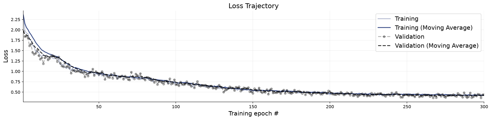
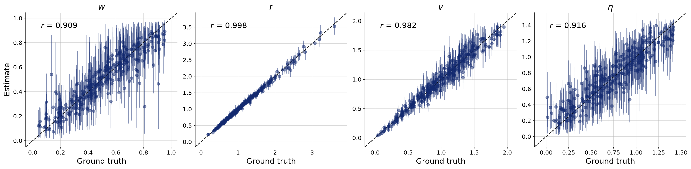
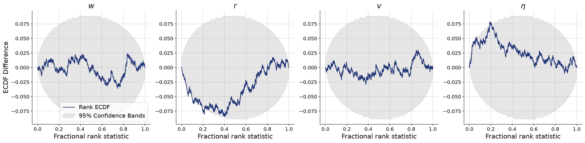
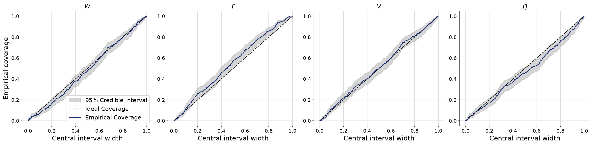
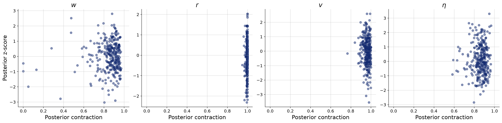

# Prior sensitivity — eta into the strongly diffusive regime

**Variant:** `v7-prior-eta-diffuse`  
**Addresses:** Reviewer point 7 (eta)

## Why this arm exists

The upper bracket, eta ~ 1.5*Beta(2,2), where heading noise starts to compete with goal-directed steering. Together with v7-prior-eta-smooth this brackets the new reference Beta(2,2), which was itself chosen by prior predictive check rather than inherited.

## Generative Configuration

| Setting | Value |
|---------|-------|
| Reviewer point addressed | Reviewer point 7 (eta) |
| Prior | prior_eta_diffuse |
| Inferred parameters | w, r, v, noise |
| Observable channels | positions, rotations, neighbors, distances, angular_velocities, neighbor_fluctuations |
| Reference radii (r-free counts) | — |
| Beacon strengths | uniform |
| Beacon spread | 50 |
| Heading update | relative bearing (rotationally invariant) |
| Agents / beacons | 49 / 4 |
| Time horizon / dt | 60s / 0.1 |
| Seed | 20260803 |

## Training and Network Configuration

| Setting | Value |
|---------|-------|
| Inference network | FlowMatching (Base, widths 256x4, time_embedding_dim 32) |
| Summary network | TransformerSummaryNet — TimeSeriesTransformer, Base (summary_dim=12) |
| Epochs | 300 |
| Batch size | 32 |
| Validation data | 300 simulations |
| Test data | 300 simulations |
| Training mode | online |
| Early stopping | off |
| Simulation budget | 300 x 50 x 32 (online, fresh each batch) |
| Wall-clock | 34.1 min |

## Convergence

The training loss curve shows the optimization objective over epochs. A healthy curve decreases smoothly and plateaus. Key warning signs: (i) a growing gap between training and validation loss indicates overfitting; (ii) loss still visibly decreasing at the final epoch means the network could benefit from more epochs; (iii) NaN spikes indicate numerical instability, often caused by extreme simulator outputs or missing standardization.

**Assessment:** Training converged without detected issues: the loss decreased and plateaued, and no divergence between training and validation loss was flagged.

## Parameter Recovery

Each panel plots the posterior median (point estimate) against the true parameter value across held-out simulations. Points falling on the diagonal indicate perfect recovery. Vertical bars represent 95% posterior credible intervals — their width reflects estimation uncertainty. Systematic deviations from the diagonal reveal bias; wide intervals indicate the data are only weakly informative for that parameter.

**Assessment:** r show recovery in the acceptable range; w, v, noise fall short.

## Calibration and Coverage

**Calibration ECDF** — Simulation-based calibration (SBC) plots show the empirical CDF of posterior ranks. Well-calibrated posteriors produce ECDFs close to the uniform diagonal. Lines consistently above the diagonal indicate overconfident (too narrow) posteriors; lines below indicate underconfident (too wide) posteriors.

**Coverage** — Shows the fraction of held-out true values falling within nominal credible intervals (e.g., 50%, 80%, 95%). Well-calibrated models yield empirical coverage matching the nominal level. Under-coverage means the credible intervals are too narrow; over-coverage means they are too wide.

**Assessment:** w, r, v, noise show calibration in the acceptable range.

## Posterior Z-Score and Contraction

The z-score–contraction plot summarizes posterior quality in two dimensions. The x-axis shows **posterior contraction** — the fraction by which the posterior variance has shrunk relative to the prior variance. Values near 0 indicate no information gain (the data are uninformative for that parameter); values near 1 indicate near-complete information gain. The y-axis shows the **posterior z-score** — the average standardized deviation between the posterior mean and the true value. Symmetric values around 0 indicate an unbiased (Gaussian-like) posterior. The ideal region is the middle-right corner (z-scores distributed around 0, high contraction).

**Assessment:** w, r, v, noise show contraction in the acceptable range.

## Numerical Diagnostic Summary

| Metric | w | r | v | noise |
|--------|-----|-----|-----|-----|
| NRMSE | 0.339 | 0.055 | 0.196 | 0.363 |
| Log-gamma | 4.272 | -1.900 | 4.632 | -1.243 |
| ECE | 0.013 | 0.051 | 0.009 | 0.031 |
| Post. Contraction | 0.880 | 0.997 | 0.963 | 0.871 |

**w** — excellent calibration; poor recovery; medium contraction

**r** — fair calibration; good recovery; high contraction

**v** — excellent calibration; poor recovery; high contraction

**noise** — excellent calibration; poor recovery; medium contraction

## Suggested Next Steps

1. Poor recovery for w, v, noise — increase network capacity and training duration; if no improvement, these parameters may be weakly identifiable.
2. Fair calibration for r — consider more training epochs or a slight capacity increase.
