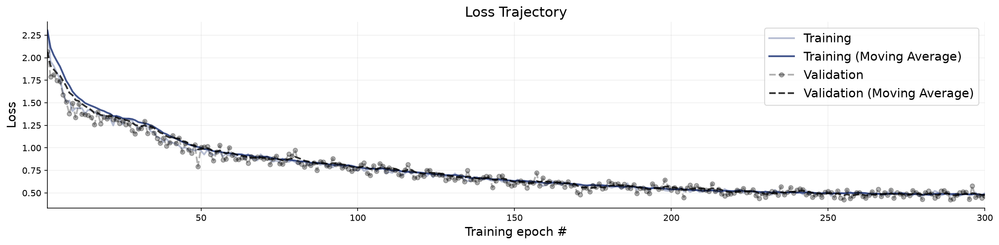
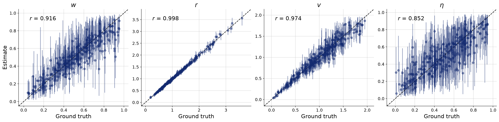
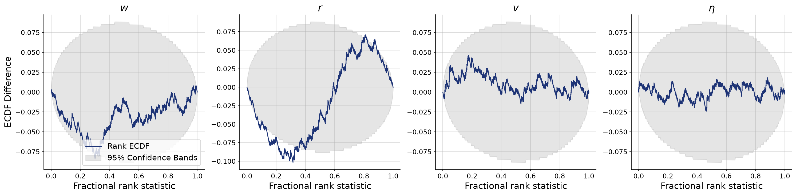
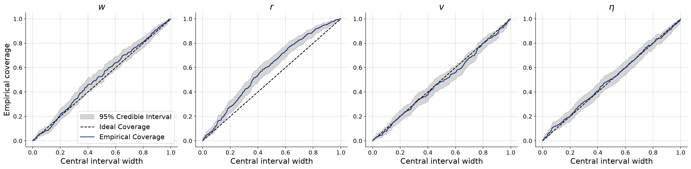
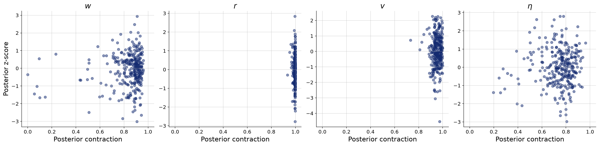

# Beacon switching driven by an observed salience schedule

**Variant:** `v8-salience-observed`  
**Addresses:** Reviewer point 8

## Why this arm exists

v2-salience-spread50 was built to measure beacon switching and contained almost none: replaying its exact configuration and recomputing the selection rule at every step gives 0.005 switches per agent per trial, with 99.7% of agents never re-targeting at all. The reason is structural. Under a STATIC salience field the score s_b^alpha / d_ib changes only through d_ib, and an agent moves toward its own target, so the choice is self-reinforcing and the room is partitioned into fixed cells each agent walks into. A posterior contraction of 0.094 on alpha was therefore not a weak signal but a nearly inert parameter. (The same replay showed alpha did not even control the initial partition: with strengths [1,1,1,8] and alpha ~ Gamma(2,1), s^alpha reaches 8-500x while beacons outside the room afford distance ratios of only 1.5-3x, so the strong beacon won for 99.8% of agents at every alpha in the prior.)

This arm makes salience time-varying instead: log s_b(t) is a shared Ornstein-Uhlenbeck process, one path per beacon, identical for every agent in a trial because salience is a property of the beacon rather than of the observer. Now the world changes underneath the agents, and re-targeting is driven by the beacon rather than by the agent's own geometry.

Crucially the salience schedule is an OBSERVABLE, not an inference target. The immersive room renders the beacons, so what each beacon was doing at each moment is something the experiment sets and records — treating it as a latent to be recovered would model away information the apparatus actually has. So sigma_s and tau_s are design constants, the inferred parameters go back to the published four, and the question becomes whether knowing the drive improves their recovery. It should help w most: a turn that coincides with a beacon brightening is attributable to the beacon rather than to unexplained noise, and w is exactly the beacon-versus-neighbour balance.

This also avoids the trap the superstatistics route would have walked into. Inferring the volatility of a parameter process has returned a null three times here — tau in v5-timevarying-w at contraction 0.076, alpha in v2 at 0.094, eta at ~0.09 — so an arm whose headline number was the posterior for sigma_s had a poor prior of saying anything.

## Generative Configuration

| Setting | Value |
|---------|-------|
| Reviewer point addressed | Reviewer point 8 |
| Prior | complete_pooling_prior |
| Inferred parameters | w, r, v, noise |
| Observable channels | positions, rotations, neighbors, distances, angular_velocities, neighbor_fluctuations, salience |
| Reference radii (r-free counts) | — |
| Beacon strengths | uniform |
| Beacon spread | 50 |
| Beacon salience | shared log-OU, sigma_s=0.7, tau_s=40s, alpha=1, switch margin 1.5x — OBSERVED |
| Heading update | relative bearing (rotationally invariant) |
| Agents / beacons | 49 / 4 |
| Time horizon / dt | 60s / 0.1 |
| Seed | 20260803 |

## Training and Network Configuration

| Setting | Value |
|---------|-------|
| Inference network | FlowMatching (Base, widths 256x4, time_embedding_dim 32) |
| Summary network | TransformerSummaryNet — TimeSeriesTransformer, Base (summary_dim=12) |
| Epochs | 300 |
| Batch size | 32 |
| Validation data | 300 simulations |
| Test data | 300 simulations |
| Training mode | online |
| Early stopping | off |
| Simulation budget | 300 x 50 x 32 (online, fresh each batch) |
| Wall-clock | 34.3 min |

## Convergence

The training loss curve shows the optimization objective over epochs. A healthy curve decreases smoothly and plateaus. Key warning signs: (i) a growing gap between training and validation loss indicates overfitting; (ii) loss still visibly decreasing at the final epoch means the network could benefit from more epochs; (iii) NaN spikes indicate numerical instability, often caused by extreme simulator outputs or missing standardization.

**Assessment:** Training converged without detected issues: the loss decreased and plateaued, and no divergence between training and validation loss was flagged.

## Parameter Recovery

Each panel plots the posterior median (point estimate) against the true parameter value across held-out simulations. Points falling on the diagonal indicate perfect recovery. Vertical bars represent 95% posterior credible intervals — their width reflects estimation uncertainty. Systematic deviations from the diagonal reveal bias; wide intervals indicate the data are only weakly informative for that parameter.

**Assessment:** r show recovery in the acceptable range; w, v, noise fall short.

## Calibration and Coverage

**Calibration ECDF** — Simulation-based calibration (SBC) plots show the empirical CDF of posterior ranks. Well-calibrated posteriors produce ECDFs close to the uniform diagonal. Lines consistently above the diagonal indicate overconfident (too narrow) posteriors; lines below indicate underconfident (too wide) posteriors.

**Coverage** — Shows the fraction of held-out true values falling within nominal credible intervals (e.g., 50%, 80%, 95%). Well-calibrated models yield empirical coverage matching the nominal level. Under-coverage means the credible intervals are too narrow; over-coverage means they are too wide.

**Assessment:** w, v, noise show calibration in the acceptable range; r fall short.

## Posterior Z-Score and Contraction

The z-score–contraction plot summarizes posterior quality in two dimensions. The x-axis shows **posterior contraction** — the fraction by which the posterior variance has shrunk relative to the prior variance. Values near 0 indicate no information gain (the data are uninformative for that parameter); values near 1 indicate near-complete information gain. The y-axis shows the **posterior z-score** — the average standardized deviation between the posterior mean and the true value. Symmetric values around 0 indicate an unbiased (Gaussian-like) posterior. The ideal region is the middle-right corner (z-scores distributed around 0, high contraction).

**Assessment:** w, v show contraction in the acceptable range; r, noise fall short.

## Numerical Diagnostic Summary

| Metric | w | r | v | noise |
|--------|-----|-----|-----|-----|
| NRMSE | 0.360 | 0.056 | 0.214 | 0.454 |
| Log-gamma | 0.332 | -3.011 | 3.674 | 3.455 |
| ECE | 0.021 | 0.101 | 0.011 | 0.010 |
| Post. Contraction | 0.882 | 0.997 | 0.955 | 0.771 |

**w** — excellent calibration; poor recovery; medium contraction

**r** — poor calibration; good recovery; poor — overconfident

**v** — excellent calibration; poor recovery; high contraction

**noise** — excellent calibration; poor recovery; low contraction

## Suggested Next Steps

1. Poor calibration for r — increase summary network capacity or train for more epochs.
2. Poor recovery for w, v, noise — increase network capacity and training duration; if no improvement, these parameters may be weakly identifiable.
3. Overconfident posteriors for r — inspect the simulator for potential issues and consider increasing the simulation budget.
4. Low contraction for noise — the data may not be informative for these parameters; consider a more informative prior or a richer summary network.
